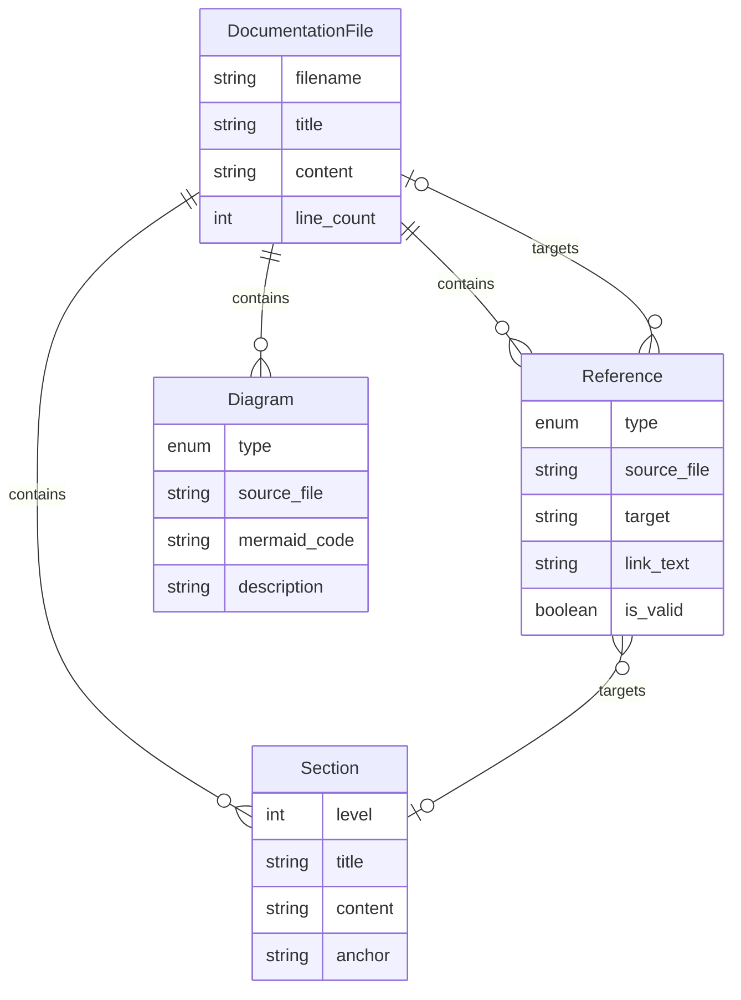

# Data Model: High-Level Documentation

**Feature**: 005-high-level-docs
**Date**: 2025-10-23

## Overview

This feature primarily deals with content/information entities rather than runtime data structures. The "data model" here describes the structure and relationships of documentation artifacts.

## Entities

### DocumentationFile

Represents a single markdown file in the docs/ directory.

**Fields**:
- `filename` (string): Name of the markdown file (e.g., "overview.md")
- `title` (string): Human-readable title extracted from first H1 header
- `content` (string): Markdown content body
- `line_count` (integer): Number of lines in the file
- `sections` (list of Section): Logical sections within the document
- `references` (list of Reference): Links to other docs or code

**Validation Rules**:
- Filename must match pattern: `^[a-z]+\.md$`
- Line count must be ≤ 500
- Must contain exactly one H1 header (# title)
- Must use ATX-style headers (# ## ###)
- All internal links must resolve to existing files or sections

**State**: Static content (no state transitions)

**Relationships**:
- Contains multiple Section entities
- Contains multiple Reference entities
- May reference other DocumentationFile entities via cross-references

---

### Section

Represents a logical section within a documentation file (denoted by headers).

**Fields**:
- `level` (integer): Header level (1-6)
- `title` (string): Section title text
- `content` (string): Section body content
- `anchor` (string): URL anchor (slugified title)

**Validation Rules**:
- Level must be 1-6
- Title must not be empty
- Headers should follow logical nesting (no skipping levels, e.g., # → ### without ##)
- Anchor must be unique within file

**Relationships**:
- Belongs to exactly one DocumentationFile
- May be referenced by Reference entities (internal anchors)

---

### Reference

Represents a link from documentation to other content (docs, code, external resources).

**Fields**:
- `type` (enum): "internal_doc", "code", "external"
- `source_file` (string): Documentation file containing the reference
- `target` (string): Reference target (file path, URL, file:line)
- `link_text` (string): Display text for the link
- `is_valid` (boolean): Whether target exists and is reachable

**Validation Rules**:
- Internal doc references must point to existing files in docs/
- Code references must use format: `path/to/file.go:line_number`
- External references must be valid URLs (http:// or https://)
- Link text must not be empty

**Types**:
- `internal_doc`: Link to another file in docs/ (e.g., [quickstart](./quickstart.md))
- `code`: Reference to source code location (e.g., internal/cli/root.go:42)
- `external`: Link to external resource (e.g., https://example.com)

**Relationships**:
- Belongs to exactly one DocumentationFile
- May target a Section (if internal doc with anchor)

---

### Diagram

Represents a visual diagram embedded in documentation using Mermaid syntax.

**Fields**:
- `type` (enum): "architecture", "workflow", "sequence"
- `source_file` (string): Documentation file containing the diagram
- `mermaid_code` (string): Mermaid diagram definition
- `description` (string): Alt text or caption

**Validation Rules**:
- Mermaid code must be valid syntax (parseable by Mermaid renderer)
- Must be enclosed in ```mermaid code fence
- Description should explain diagram purpose for accessibility

**Types**:
- `architecture`: System component diagram (architecture.md)
- `workflow`: Execution flow diagram (architecture.md, quickstart.md)
- `sequence`: Interaction sequence (architecture.md)

**Relationships**:
- Belongs to exactly one DocumentationFile
- May reference entities in code (components, packages)

---

## Relationships Diagram



## File-Specific Entity Mapping

### overview.md
- **Primary Purpose**: Project introduction
- **Key Sections**: What is it, Key Features, Target Audience, Use Cases
- **References**: Links to quickstart.md, architecture.md, external project links
- **Diagrams**: None (concise text-only introduction)

### quickstart.md
- **Primary Purpose**: Get users started in 10 minutes
- **Key Sections**: Installation, First Workflow, Common Commands, Next Steps
- **References**: Links to reference.md for detailed options, troubleshooting.md for issues
- **Diagrams**: Simple workflow diagram showing specify → plan → tasks → implement flow

### architecture.md
- **Primary Purpose**: System design and component relationships
- **Key Sections**: Component Overview, Execution Flow, Key Patterns, Integration Points
- **References**: Code references (file:line) to all internal/ packages
- **Diagrams**: Architecture diagram (components), workflow execution flow, phase retry mechanism

### reference.md
- **Primary Purpose**: Command and configuration lookup
- **Key Sections**: CLI Commands, Configuration Options, Exit Codes, File Locations
- **References**: Links to quickstart.md for examples, code references to command implementations
- **Diagrams**: None (reference table format)

### troubleshooting.md
- **Primary Purpose**: Error resolution guide
- **Key Sections**: Common Errors, Exit Code Reference, Debugging Tips, FAQ
- **References**: Links to reference.md for configuration, code references to error handling
- **Diagrams**: Decision tree for troubleshooting workflow failures (optional)

## Validation Matrix

| Entity | Validation Method | Success Criteria |
|--------|-------------------|------------------|
| DocumentationFile | Line count check | ≤ 500 lines |
| DocumentationFile | Header validation | Exactly one H1, logical nesting |
| Section | Anchor uniqueness | No duplicate anchors in file |
| Reference (internal) | File existence | Target file exists in docs/ |
| Reference (code) | Format validation | Matches `file:line` pattern |
| Reference (external) | URL validation | Valid HTTP/HTTPS URL |
| Diagram | Mermaid syntax | Parseable by Mermaid renderer |

## Test Coverage Requirements

Tests must verify:

1. **File Existence**: All 5 documentation files exist in docs/
2. **Line Limits**: Each file has ≤ 500 lines
3. **Header Structure**: Each file has valid H1 and nested headers
4. **Internal Links**: All cross-references point to existing files
5. **Code References**: All file:line references use correct format
6. **Mermaid Diagrams**: All diagram code blocks are syntactically valid
7. **Completeness**: All CLI commands documented, all config options documented

## Notes

- This is a content-centric feature, so the "data model" is descriptive rather than prescriptive
- No runtime data structures or database schemas involved
- Validation can be implemented as simple bash scripts or Go test functions
- Consider creating a docs validation tool (internal/validation/docs.go) for reusability
